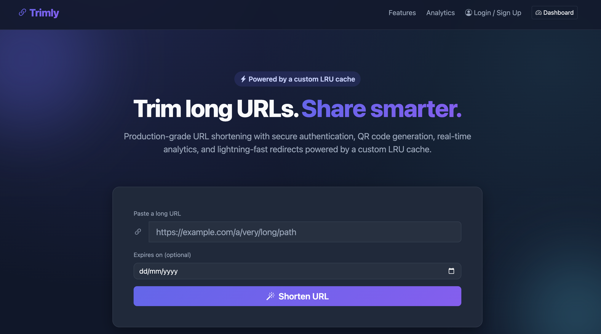
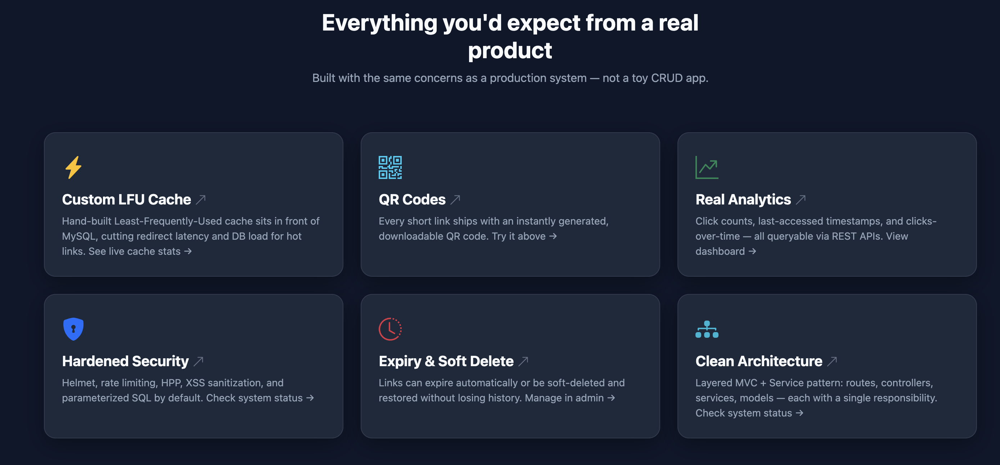
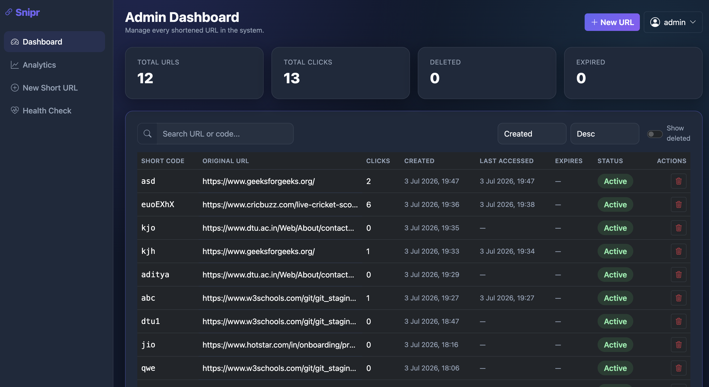
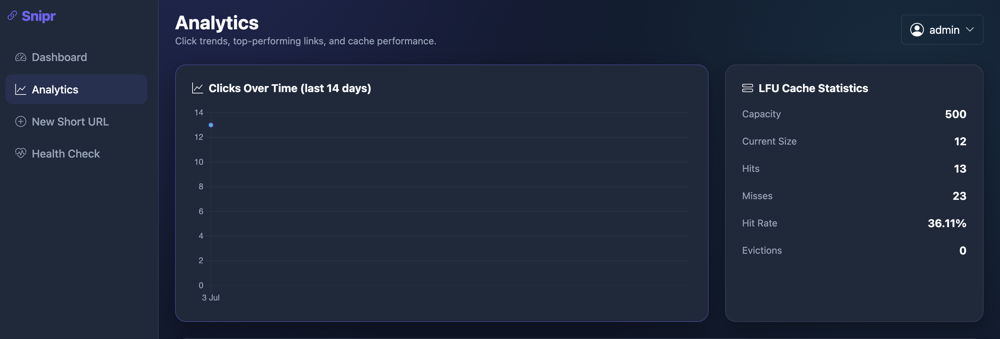
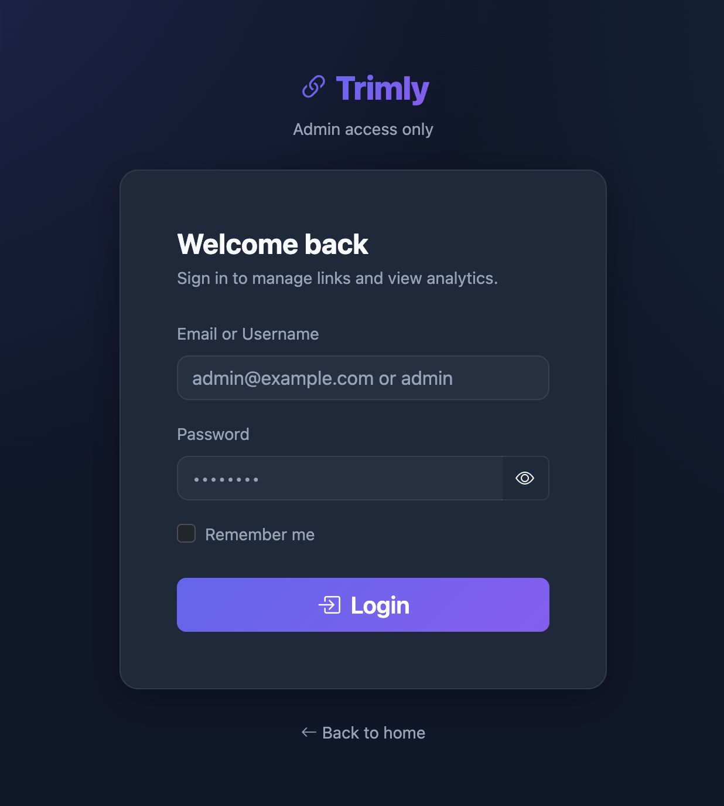
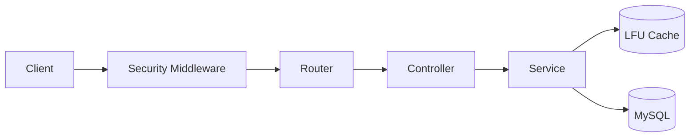
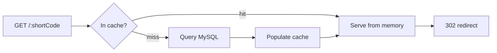

<p align="center">
  
</p>

<h1 align="center">Trimly</h1>
<p align="center"><strong>A production-style URL Shortener built with Node.js, Express &amp; MySQL</strong><br/>Featuring a hand-built O(1) LFU cache, JWT admin authentication with OTP password reset, click analytics, QR codes, and full audit logging.</p>

<p align="center">
  <a href="https://github.com/adityathakur-09/url-shortener/actions/workflows/ci.yml"></a>
  
  
  
  
  <a href="CONTRIBUTING.md"></a>
  
</p>

<p align="center">
  <a href="#live-demo">Live Demo</a> ·
  <a href="#features">Features</a> ·
  <a href="#architecture">Architecture</a> ·
  <a href="#installation">Installation</a> ·
  <a href="#api-documentation">API Docs</a> ·
  <a href="#faq">FAQ</a>
</p>

---

## Live Demo

🔗 **https://web-production-581a.up.railway.app**

The shorten → redirect → QR code flow is fully public — try it right now, no login needed. Admin dashboard credentials available on request (see [Author](#author)).

## Table of Contents

- [Features](#features)
- [Screenshots](#screenshots)
- [Architecture](#architecture)
- [Folder Structure](#folder-structure)
- [Tech Stack](#tech-stack)
- [Installation](#installation)
- [Environment Variables](#environment-variables)
- [Database Setup](#database-setup)
- [Running Locally](#running-locally)
- [Deployment](#deployment)
- [API Documentation](#api-documentation)
- [Admin Dashboard](#admin-dashboard)
- [Analytics Dashboard](#analytics-dashboard)
- [Authentication &amp; Security](#authentication--security)
- [LFU Cache](#lfu-cache)
- [QR Code Generation](#qr-code-generation)
- [Logging](#logging)
- [Future Enhancements](#future-enhancements)
- [FAQ](#faq)
- [Contributing](#contributing)
- [Author](#author)
- [License](#license)

## Features

| | |
|---|---|
| 🔗 **URL Shortening** | Custom aliases, automatic duplicate detection, optional expiry dates |
| ⚡ **Custom LFU Cache** | Hand-built, from-scratch O(1) Least-Frequently-Used cache in front of MySQL — no Redis |
| 🔐 **JWT Admin Auth** | HttpOnly cookies, bcrypt hashing, account lockout, full audit logging |
| 📧 **OTP Password Reset** | 6-digit code, sandboxed test-mailer (no real email credentials required) |
| 📊 **Click Analytics** | Click counts, last-accessed timestamps, clicks-over-time chart |
| 📱 **QR Codes** | Instantly generated for every short URL |
| 🗑️ **Soft Delete &amp; Restore** | Links are never hard-deleted — fully reversible |
| 🛡️ **Hardened Security** | Helmet, rate limiting, HPP, XSS sanitization, parameterized SQL everywhere |
| 🎨 **Premium Dark UI** | Bootstrap 5 glassmorphism design — landing, admin, and analytics dashboards |
| 📝 **Structured Logging** | Separate app/error/request logs |

## Screenshots

| Landing Page | Features |
|---|---|
|  |  |

| Admin Dashboard | Analytics Dashboard |
|---|---|
|  |  |

| Login Page |
|---|
|  |

## Architecture

Layered MVC + Service architecture — Router → Controller → Validator → Service → Model/Cache. Full diagrams (system architecture, MVC sequence flow, request flows) live in **[docs/ARCHITECTURE.md](docs/ARCHITECTURE.md)**.



**Redirect flow (the hot path):**
```
GET /:shortCode → LFU cache lookup
    → HIT:  return cached long_url, redirect immediately
    → MISS: query MySQL, populate cache, redirect
  → click_count / last_accessed_at / click_events updated
    asynchronously AFTER the redirect response is sent
```

## Folder Structure

```
src/
├── config/       # env loading, MySQL connection pool
├── constants/    # HTTP status codes, user-facing messages
├── models/       # parameterized SQL query modules (no ORM)
├── validators/   # input validation (URL, auth, password rules)
├── cache/        # custom O(1) LFU cache implementation
├── services/     # business logic: url, cache, qrcode, analytics, auth, email
├── controllers/  # HTTP req/res translation
├── routes/       # Express routers
├── middleware/   # error handling, rate limiting, security stack, JWT auth guards
├── utils/        # AppError, asyncHandler, logger, jwt, password hashing, otp
├── scripts/      # schema.sql + DB init/seed scripts
└── app.js        # Express app assembly

public/           # static frontend assets (css/js)
views/            # server-rendered static HTML pages
docs/             # architecture, API, database, security, deployment, cache docs
.github/          # issue templates, PR template, CI workflow
logs/             # app.log / error.log / request.log (gitignored)
server.js         # process entry point
```

## Tech Stack

**Backend:** Node.js, Express.js, MySQL (via `mysql2`), JWT (`jsonwebtoken`), bcrypt (`bcryptjs`)
**Frontend:** HTML5, Bootstrap 5, vanilla JavaScript, Chart.js
**Security:** Helmet, express-rate-limit, HPP, `xss`, CORS
**Email:** Nodemailer (Ethereal sandboxed test SMTP)
**Deployment:** Railway (app + managed MySQL)

## Installation

**Prerequisites:** Node.js 18+, a running MySQL 8+ instance.

```bash
git clone https://github.com/adityathakur-09/url-shortener.git
cd url-shortener
npm install
```

## Environment Variables

Copy the example file and fill in your own values:

```bash
cp .env.example .env
```

| Variable | Purpose |
|---|---|
| `PORT`, `BASE_URL` | Server port and public base URL (used to build short URLs) |
| `DB_HOST`, `DB_PORT`, `DB_USER`, `DB_PASSWORD`, `DB_NAME` | MySQL connection |
| `CACHE_CAPACITY` | Max entries held by the LFU cache (default `500`) |
| `RATE_LIMIT_MAX`, `RATE_LIMIT_WINDOW_MS` | API rate limiting |
| `SHORT_CODE_LENGTH` | Length of generated short codes |
| `JWT_SECRET` | Signing key for admin sessions — generate with `node -e "console.log(require('crypto').randomBytes(48).toString('hex'))"` |
| `JWT_EXPIRES_IN`, `COOKIE_NAME` | Session token lifetime (default `2h`) and cookie name |
| `MAX_LOGIN_ATTEMPTS`, `LOCK_DURATION_MINUTES` | Account lockout thresholds |
| `ADMIN_USERNAME`, `ADMIN_EMAIL`, `ADMIN_PASSWORD` | Used only by `npm run db:seed` |
| `OTP_EXPIRY_MINUTES` | Password-reset OTP lifetime |

See [.env.example](.env.example) for the complete, always-up-to-date list.

## Database Setup

```bash
npm run db:init     # creates the database + all tables (idempotent — safe to re-run)
npm run db:seed      # creates the default admin from ADMIN_* env vars (idempotent)
```

Full schema, ER diagram, and the reasoning behind every column/index: **[docs/DATABASE.md](docs/DATABASE.md)**.

## Running Locally

```bash
npm run dev          # nodemon, auto-restarts on file changes
# or
npm start             # plain node, no auto-restart
```

Visit `http://localhost:3000`. Admin dashboard: `http://localhost:3000/login` (credentials from `ADMIN_EMAIL`/`ADMIN_PASSWORD`).

## Deployment

Deployed on **Railway** — app and managed MySQL as two services in one project, source-connected to `main` for continuous deployment. Full guide, diagram, and reproducible CLI steps: **[docs/DEPLOYMENT.md](docs/DEPLOYMENT.md)**.

## API Documentation

Full endpoint reference with request/response examples: **[docs/API.md](docs/API.md)**.

**Quick reference:**

| Method | Endpoint | Auth | Description |
|---|---|---|---|
| POST | `/api/url` | Public | Create a short URL |
| GET | `/:shortCode` | Public | Redirect to the original URL |
| GET | `/api/url/:shortCode/qrcode` | Public | Get a QR code |
| POST | `/api/auth/login` | Public | Admin login |
| POST | `/api/auth/forgot-password` | Public | Request an OTP reset code |
| PUT | `/api/url/:id` | 🔒 | Update a URL |
| DELETE | `/api/url/:id` | 🔒 | Soft-delete a URL |
| GET | `/api/admin/dashboard` | 🔒 | Aggregate stats + analytics + cache stats |

**Example:**
```bash
curl -X POST https://web-production-581a.up.railway.app/api/url \
  -H "Content-Type: application/json" \
  -d '{"longUrl": "https://example.com/some/very/long/path", "customAlias": "my-link"}'
```

## Admin Dashboard

Protected (`/admin`) — search/sort/paginate every shortened URL, soft-delete/restore, and view live stat tiles (total URLs, total clicks, deleted, expired). Every mutation is written to the audit log (`admin_logs`).

## Analytics Dashboard

Protected (`/analytics`) — a Chart.js line chart of clicks over the last 14 days, a most-clicked-URLs table, and live LFU cache statistics (hit rate, size, evictions).

## Authentication & Security

Single-role JWT admin authentication — see the full technical write-up (auth flow diagrams, cookie security, brute-force defense-in-depth, injection defenses) in **[docs/SECURITY.md](docs/SECURITY.md)**, and the responsible-disclosure policy in **[SECURITY.md](SECURITY.md)**.

**At a glance:**
- Passwords hashed with **bcrypt** (12 salt rounds) — never stored or logged in plaintext.
- JWT stored in an **`HttpOnly`, `Secure` (prod), `SameSite=Lax`** cookie — never `localStorage`.
- **Per-account lockout** (5 failed attempts → 15 min) layered with **per-IP rate limiting**.
- **Parameterized SQL** everywhere — no string-concatenated queries.
- **Helmet, HPP, XSS sanitization, CORS** on every request.

## LFU Cache

A hand-built, from-scratch **O(1) Least-Frequently-Used cache** sits in front of MySQL for the redirect endpoint — no Redis. Full data-structure walkthrough, complexity analysis, LFU-vs-LRU comparison, and the production Redis migration path: **[docs/CACHE.md](docs/CACHE.md)**.



## QR Code Generation

Every short URL gets an instantly generated QR code (`GET /api/url/:shortCode/qrcode`), returned as a base64 PNG data URL, generated with the [`qrcode`](https://www.npmjs.com/package/qrcode) package — shown automatically on the landing page right after shortening.

## Logging

Structured logging via Morgan (HTTP request logs) plus a custom logger (`src/utils/logger.js`) writing separate `logs/app.log`, `logs/error.log`, and `logs/request.log` files — each entry is a JSON line with a timestamp, level, message, and structured metadata.

## Future Enhancements

- [ ] Automated test suite (unit tests for the LFU cache and services, integration tests for the API)
- [ ] Swap the in-process LFU cache for Redis to share cache state across multiple instances
- [ ] Move click-event writes to a message queue, fully decoupling redirect latency from analytics
- [ ] Refresh tokens / JWT revocation for true session invalidation
- [ ] Multi-role admin system (`requireAdmin` is already structured to grow into role-based checks)
- [ ] A visible audit-log page in the admin UI (data already captured in `admin_logs`)
- [ ] A public `GET /healthz` liveness route so hosting platforms can run automated health checks
- [ ] Read replica for MySQL to separate redirect (read) traffic from write traffic

## FAQ

**Why LFU instead of LRU or no cache at all?**
URL shortener traffic is power-law distributed — a few links get most of the clicks. LFU keeps genuinely popular links resident even through short quiet periods, where LRU would evict them. Full reasoning in [docs/CACHE.md](docs/CACHE.md).

**Why is the JWT in a cookie instead of `localStorage`?**
`localStorage` is readable by any JavaScript on the page, including an XSS payload — a single XSS bug means the token is stolen. An `HttpOnly` cookie is invisible to JavaScript entirely. See [docs/SECURITY.md](docs/SECURITY.md).

**Why doesn't the forgot-password email actually arrive in my inbox?**
It's intentionally sent through **Ethereal**, a sandboxed test-SMTP service — not a real provider. This avoids exposing any real personal or team email credentials in a public repository, while still exercising a genuine SMTP send path. The response includes a preview link to view the "sent" email. See [docs/SECURITY.md](docs/SECURITY.md) for the full reasoning.

**Why MySQL and not PostgreSQL/MongoDB?**
The project spec called for MySQL specifically; the schema/queries are plain parameterized SQL with no ORM, so porting to PostgreSQL would mainly mean adjusting a handful of MySQL-specific syntax choices (e.g. `ON UPDATE CURRENT_TIMESTAMP`).

**Is this using an ORM?**
No — every query is hand-written in `src/models/*.model.js` using `mysql2`'s named-placeholder parameterized queries. This was a deliberate choice for learning/interview purposes: understanding exactly what SQL runs, when, and why.

**Can I run this without MySQL, just to poke around the frontend?**
Not currently — the app requires a live MySQL connection at startup (`server.js` verifies the connection before listening). Easiest path: use the [live demo](#live-demo) instead.

## Contributing

Contributions are welcome — see **[CONTRIBUTING.md](CONTRIBUTING.md)** for setup, code style, and PR guidelines. Please also read the **[Code of Conduct](CODE_OF_CONDUCT.md)**.

## Author

**Aditya Thakur**
GitHub: [@adityathakur-09](https://github.com/adityathakur-09)

Built as a hands-on backend engineering project to go deep on system design fundamentals — layered architecture, caching strategy, authentication, and production security concerns — rather than just shipping a CRUD app.

## License

MIT — see [LICENSE](LICENSE).


