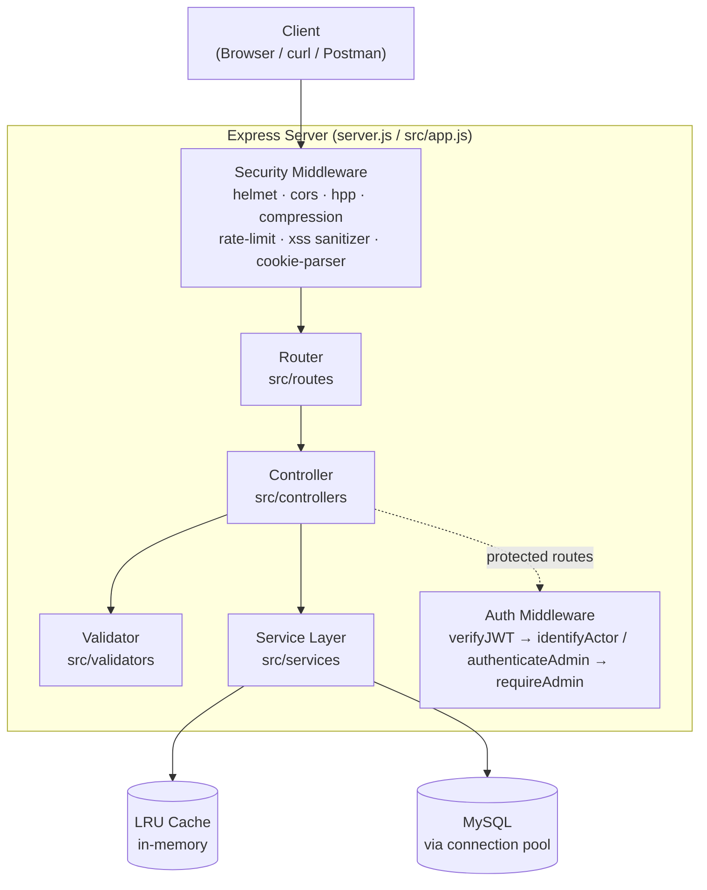
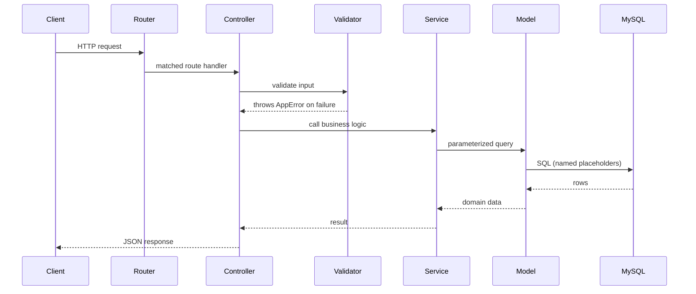
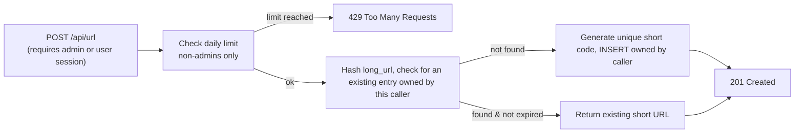
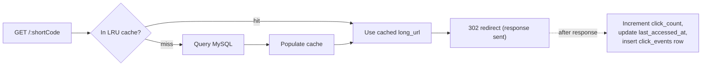
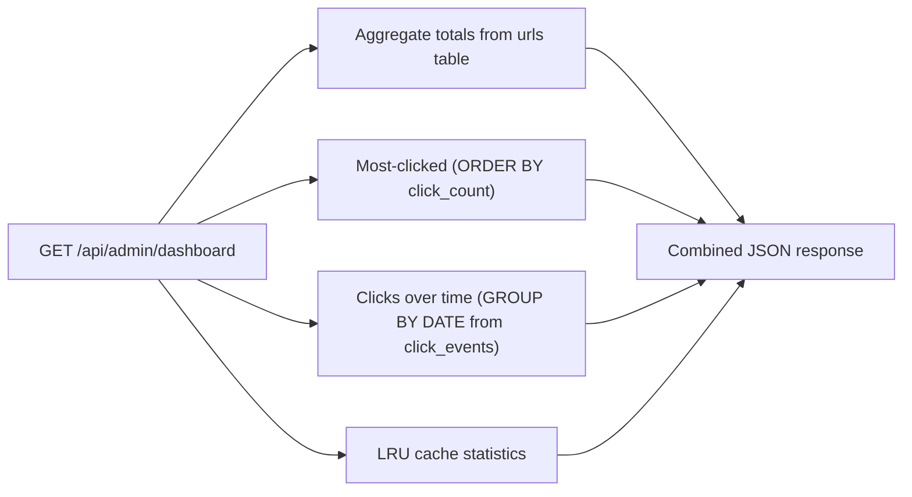

# Architecture

Trimly is a layered monolith — one deployable Node.js process, internally organized into distinct layers with single responsibilities (Router → Controller → Validator → Service → Model/Cache). This document covers the system-level architecture; for API contracts see [API.md](API.md), for the database see [DATABASE.md](DATABASE.md), for the cache see [CACHE.md](CACHE.md).

## Why a layered monolith (not microservices)

Microservices solve organizational and independent-scaling problems — they don't automatically make an app faster or more "production-grade." This project has no team-ownership boundary and no component that needs to scale independently of the others, so a single well-layered process is the correct architecture, not a simplification. The layering itself (not the process count) is what gives us testability, single-responsibility modules, and the ability to swap implementations (e.g. LRU cache → Redis) without touching unrelated code.

## System Architecture

## MVC + Service Layer flow

Every request follows the same shape, whether it's a URL-creation request from an admin or a regular user:

**Why each layer exists:**

| Layer | Responsibility | Changes when... |
|---|---|---|
| Router (`src/routes`) | Maps URL + HTTP verb → controller function | An endpoint is added/renamed |
| Controller (`src/controllers`) | Translates HTTP req/res ↔ plain data | The API's request/response shape changes |
| Validator (`src/validators`) | Rejects malformed input before it reaches business logic | Validation rules change |
| Service (`src/services`) | Business logic — the only layer allowed to make multi-step decisions | Business rules change |
| Model (`src/models`) | Parameterized SQL, one function per query | The persistence layer or schema changes |

This is the **Single Responsibility Principle** applied at the architectural level: each layer has exactly one reason to change, which bounds the blast radius of any modification and makes each layer independently unit-testable.

## Node.js execution model (why this matters for the redirect hot path)

Node.js runs application JavaScript on a single thread but handles thousands of concurrent connections via an event loop and non-blocking I/O (backed by libuv). A route handler that does `await db.query(...)` doesn't block the thread while waiting — Node hands the I/O operation to the OS/libuv and is free to process other requests, resuming this handler only when the result is ready.

This is why:
- The **LRU cache lookup must be synchronous and in-memory** — any slow synchronous operation blocks the entire event loop for *every* request, not just the current one.
- **Analytics writes** (click count, last-accessed timestamp) fire *after* the redirect response is already sent, rather than being awaited first — the user should never wait on bookkeeping.

## Request flows

### URL creation

### Redirect (the hot path)

### Analytics aggregation

## Frontend

Static HTML5/Bootstrap 5/vanilla JS, served directly by Express (`public/` for assets, `views/` for pages) — no build step, no client-side framework. This keeps the app deployable as a single process with zero frontend tooling, appropriate for the project's scope.
