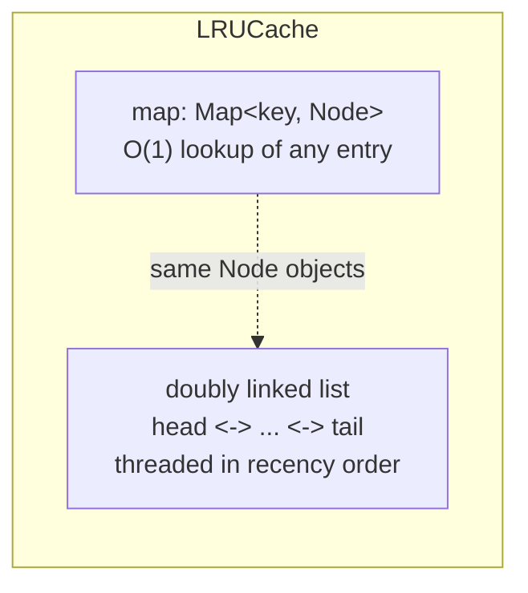
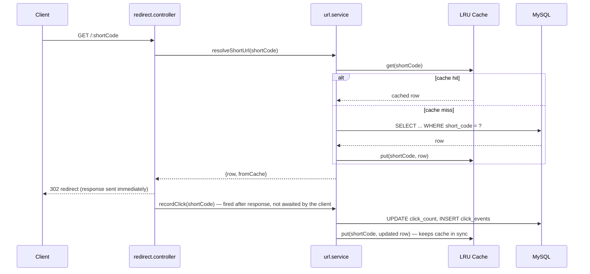

# LRU Cache

A hand-built, in-process **O(1) Least-Recently-Used cache** (`src/cache/LRUCache.js`) sitting cache-aside in front of MySQL for the redirect endpoint. No Redis, no external dependency — this is a from-scratch data structure, which is exactly the point: it's the most interview-relevant piece of this project.

## Why cache the redirect path at all

Redirects vastly outnumber URL creations in real traffic — every click on a shortened link is a read, while a URL is only created once. Without a cache, every single redirect hits MySQL. With a cache, only the *first* redirect for a given short code (or the first after eviction) touches the database; every subsequent redirect for a hot link is served entirely from memory.

## Why LRU over LFU

LRU evicts based on recency of last access — the simplest possible policy, and cheap to reason about: whatever hasn't been touched in the longest time goes first. It handles the common case well (a link that's currently being shared gets clicked repeatedly in a short window and stays resident) without the extra bookkeeping LFU requires (per-key frequency counters, a frequency-bucket structure, and a `minFreq` pointer that must be maintained on every access).

| | LRU (this project) | LFU |
|---|---|---|
| Eviction basis | Recency of last access | Total access frequency |
| Good for | Uniform/temporal-locality traffic, simplicity | Power-law/skewed traffic |
| Weakness | Can evict a popular-but-momentarily-quiet item | Slow to adapt to *new* trending items ("new item problem"), more bookkeeping |

## Data structure

- `map` gives O(1) access to any entry's `Node` by key.
- The doubly linked list threads every `Node` together in recency order: `head` side is most-recently-used, `tail` side is least-recently-used. Sentinel `head`/`tail` nodes remove edge-case branching for an empty list or a single-node list — every real node always has a real `prev`/`next`.
- `get()`, and `put()` on an existing key, move that node to the front (most-recently-used end). Eviction always removes `tail.prev` (the least-recently-used end) — no scanning, no frequency tracking.

## Operations — all O(1)

| Method | What it does |
|---|---|
| `get(key)` | Miss → return `undefined`. Hit → move node to front, return value. |
| `put(key, value)` | Existing key → update value + move to front. New key at capacity → evict first, then insert at front. |
| `eviction()` | Remove `tail.prev` (the least-recently-used entry). |
| `delete(key)` | Explicit removal (used when a URL is deleted, so the cache never serves a stale entry). |
| `has(key)` / `size()` / `clear()` / `statistics()` | Introspection — `statistics()` backs `GET /api/admin/cache`. |

## Complexity

- **Time**: O(1) for `get`, `put`, `delete`, and `eviction`.
- **Space**: O(capacity) — bounded by `CACHE_CAPACITY` (default 500), so memory use is predictable regardless of how many URLs exist in the database.

## Integration into the redirect flow

Cache invalidation: `delete`/`update`/`restore` on a URL explicitly calls `urlCache.delete(shortCode)` (or re-`put`s the fresh row), so the cache never serves stale data after an admin mutation — see `src/services/url.service.js`.

## Production path: swapping in Redis

The rest of the codebase only depends on `get`/`put`/`delete`/`statistics` (see `src/services/cache.service.js` — a single shared instance the rest of the app imports). To move to Redis in production:

1. Replace `cache.service.js`'s `new LRUCache(capacity)` with a Redis client.
2. Either implement the same interface on top of Redis commands (`GET`/`SET` plus `allkeys-lru` eviction policy, which is a built-in Redis maxmemory policy), letting Redis itself handle eviction.
3. No other file needs to change — controllers and services only ever call the four methods above.

This also solves the one real limitation of the current design: the in-process cache doesn't share state across multiple server instances. A Redis-backed cache would be shared, which matters the moment this app runs behind a load balancer with more than one instance.
