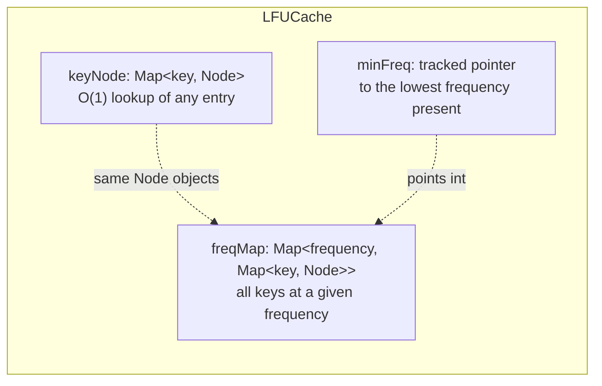

# LFU Cache

A hand-built, in-process **O(1) Least-Frequently-Used cache** (`src/cache/LFUCache.js`) sitting cache-aside in front of MySQL for the redirect endpoint. No Redis, no external dependency — this is a from-scratch data structure, which is exactly the point: it's the most interview-relevant piece of this project.

## Why cache the redirect path at all

Redirects vastly outnumber URL creations in real traffic — every click on a shortened link is a read, while a URL is only created once. Without a cache, every single redirect hits MySQL. With a cache, only the *first* redirect for a given short code (or the first after eviction) touches the database; every subsequent redirect for a hot link is served entirely from memory.

## Why LFU over LRU

URL shortener traffic is typically power-law distributed — a small number of links account for the vast majority of clicks (a link shared in a viral tweet vs. thousands of one-off personal links). **LRU (Least Recently Used)** evicts based on recency, which means a genuinely popular link can get evicted just because it wasn't clicked in the last few minutes, while a link that was clicked five times in a row just now — but will never be clicked again — stays resident. **LFU (Least Frequently Used)** evicts based on total frequency, so it correctly keeps the *actually* popular links resident regardless of short-term quiet periods.

| | LRU | LFU (this project) |
|---|---|---|
| Eviction basis | Recency of last access | Total access frequency |
| Good for | Uniform/temporal-locality traffic | Power-law/skewed traffic |
| Weakness | Evicts popular-but-quiet items | Slow to adapt to *new* trending items ("new item problem") |

## Data structure

- `keyNode` gives O(1) access to any entry by key.
- `freqMap` groups entries by frequency. Each bucket is itself a `Map`, which preserves insertion order — this gives LRU-within-frequency ordering **for free**, used as the tie-breaker when multiple keys share the minimum frequency.
- `minFreq` is maintained incrementally (never recomputed by scanning), so eviction is O(1): look up `freqMap.get(minFreq)`, take its first entry.

## Operations — all O(1)

| Method | What it does |
|---|---|
| `get(key)` | Miss → return `undefined`. Hit → bump frequency, move to the next bucket, return value. |
| `put(key, value)` | Existing key → update value + bump frequency. New key at capacity → evict first, then insert at frequency 1. |
| `updateFrequency(key)` | Remove from current bucket, increment `node.freq`, re-insert into the new bucket. If the old bucket becomes empty and *was* `minFreq`, increment `minFreq`. |
| `eviction()` | Take the first entry in `freqMap.get(minFreq)` (oldest among least-frequent) and remove it. |
| `delete(key)` | Explicit removal (used when a URL is deleted, so the cache never serves a stale entry). |
| `size()` / `clear()` / `statistics()` | Introspection — `statistics()` backs `GET /api/admin/cache`. |

## Complexity

- **Time**: O(1) for `get`, `put`, `delete`, and `eviction`.
- **Space**: O(capacity) — bounded by `CACHE_CAPACITY` (default 500), so memory use is predictable regardless of how many URLs exist in the database.

## Integration into the redirect flow

Cache invalidation: `delete`/`update`/`restore` on a URL explicitly calls `urlCache.delete(shortCode)` (or re-`put`s the fresh row), so the cache never serves stale data after an admin mutation — see `src/services/url.service.js`.

## Production path: swapping in Redis

The rest of the codebase only depends on `get`/`put`/`delete`/`statistics` (see `src/services/cache.service.js` — a single shared instance the rest of the app imports). To move to Redis in production:

1. Replace `cache.service.js`'s `new LFUCache(capacity)` with a Redis client.
2. Either implement the same interface using Redis sorted sets (`ZADD`/`ZINCRBY` for frequency tracking), or use Redis's own built-in `allkeys-lfu` eviction policy and let Redis itself handle eviction.
3. No other file needs to change — controllers and services only ever call the four methods above.

This also solves the one real limitation of the current design: the in-process cache doesn't share state across multiple server instances. A Redis-backed cache would be shared, which matters the moment this app runs behind a load balancer with more than one instance.
