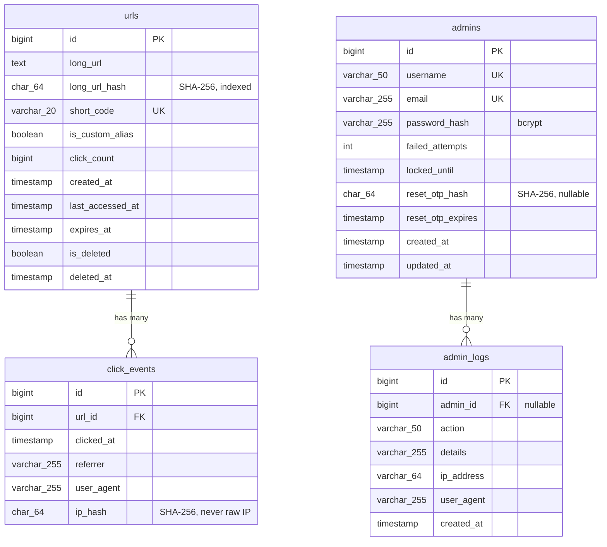

# Database

MySQL, no ORM — every query is hand-written, parameterized SQL in `src/models/*.model.js`. Schema lives in `src/scripts/schema.sql`; `npm run db:init` applies it (idempotently — safe to re-run).

## Entity-Relationship Diagram

## Why each column exists

### `urls`
| Column | Why |
|---|---|
| `long_url_hash` | SHA-256 of `long_url`, indexed. Duplicate detection queries hash equality instead of comparing full `TEXT` columns — much cheaper, and `TEXT` can't be indexed directly at useful length in MySQL. |
| `is_custom_alias` | Distinguishes user-branded aliases from generated codes. Duplicate detection deliberately only pools *non*-custom submissions together — a custom alias is a deliberate, distinct branded link and shouldn't be silently merged with someone else's generated code for the same URL. |
| `click_count` | Denormalized counter, updated on every redirect. Kept on `urls` (rather than always `COUNT(*)`-ing `click_events`) because it's read on every admin list/dashboard view — cheap to maintain, expensive to recompute constantly. |
| `is_deleted` / `deleted_at` | Soft delete — rows are never physically removed by the delete endpoint, so restore is always possible and click history is preserved. |
| `expires_at` | Nullable — most links never expire. Checked at redirect time; an expired link returns `410 Gone`, not `404`. |

### `click_events`
One row per redirect — never aggregated in place, only queried in aggregate (`GROUP BY DATE(clicked_at)` for the clicks-over-time chart). Kept as a separate table rather than bloating `urls` with a JSON blob or similar, so it can grow unboundedly without affecting the hot `urls` table's row size.

`ip_hash` — the raw IP is never stored, only its SHA-256 hash. This is enough to support future features like "detect repeated clicks from the same origin" without persisting personally identifiable raw IPs.

### `admins` / `admin_logs`
See [SECURITY.md](SECURITY.md) for the full reasoning behind `password_hash` (bcrypt, not encryption), `failed_attempts`/`locked_until` (account lockout), and `reset_otp_hash`/`reset_otp_expires` (OTP-based password reset). `admin_logs.admin_id` is nullable specifically so a failed login attempt against a *nonexistent* email can still be recorded for audit purposes.

## Indexes

| Table | Index | Purpose |
|---|---|---|
| `urls` | `UNIQUE (short_code)` | Redirect lookups are the hottest query in the app — must be O(1)/O(log n), not a scan. |
| `urls` | `INDEX (long_url_hash)` | Duplicate-detection lookups on creation. |
| `urls` | `INDEX (created_at)`, `INDEX (is_deleted)`, `INDEX (expires_at)` | Admin list filtering/sorting. |
| `click_events` | `INDEX (url_id)` | Per-URL click history. |
| `click_events` | `INDEX (clicked_at)` | Date-range aggregation for the clicks-over-time chart. |
| `admins` | `UNIQUE (username)`, `UNIQUE (email)` | Login lookup + prevents duplicate accounts. |
| `admin_logs` | `INDEX (admin_id)`, `INDEX (action)`, `INDEX (created_at)` | Audit log filtering. |

## Migrations

There's no migration framework — `schema.sql` uses `CREATE TABLE IF NOT EXISTS`, so it's safe to re-run against an existing database (it won't touch tables that already exist). Adding a column to an *existing* table needs a one-off idempotent check instead (see `addColumnIfMissing()` in `src/scripts/initDb.js` — this MySQL version doesn't support `ADD COLUMN IF NOT EXISTS`, so the idempotency check happens in JS via `information_schema.COLUMNS` instead).
