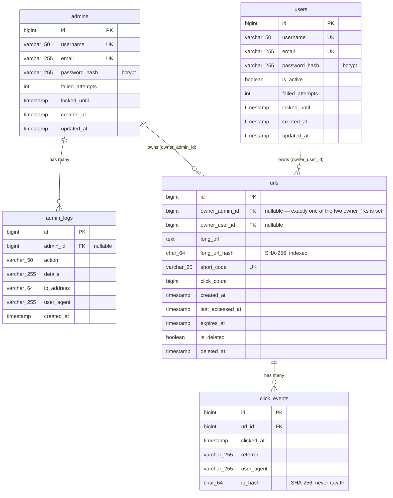

# Database

MySQL, no ORM — every query is hand-written, parameterized SQL in `src/models/*.model.js`. Schema lives in `src/scripts/schema.sql`; `npm run db:init` applies it (idempotently — safe to re-run).

## Entity-Relationship Diagram

## Why each column exists

### `urls`
| Column | Why |
|---|---|
| `owner_admin_id` / `owner_user_id` | Every URL is owned by exactly one identity — an admin or a user, never both, never neither. MySQL can't FK a single column to "one of two tables", so ownership is two nullable FKs plus `chk_url_owner`, a `CHECK` constraint enforcing exactly one is set. |
| `long_url_hash` | SHA-256 of `long_url`, indexed. Duplicate detection queries hash equality instead of comparing full `TEXT` columns — much cheaper, and `TEXT` can't be indexed directly at useful length in MySQL. |
| `click_count` | Denormalized counter, updated on every redirect. Kept on `urls` (rather than always `COUNT(*)`-ing `click_events`) because it's read on every admin list/dashboard view — cheap to maintain, expensive to recompute constantly. |
| `is_deleted` / `deleted_at` | Soft delete — rows are never physically removed by the delete endpoint, so restore is always possible and click history is preserved. |
| `expires_at` | Nullable — most links never expire. Checked at redirect time; an expired link returns `410 Gone`, not `404`. |

### `click_events`
One row per redirect — never aggregated in place, only queried in aggregate (`GROUP BY DATE(clicked_at)` for the clicks-over-time chart). Kept as a separate table rather than bloating `urls` with a JSON blob or similar, so it can grow unboundedly without affecting the hot `urls` table's row size.

`ip_hash` — the raw IP is never stored, only its SHA-256 hash. This is enough to support future features like "detect repeated clicks from the same origin" without persisting personally identifiable raw IPs.

### `admins` / `users` / `admin_logs`
`users` mirrors `admins`' shape (same `password_hash`/`failed_attempts`/`locked_until` lockout behavior) but is kept as a fully separate table rather than a unified "accounts" table with a role column, so admin login/lookups are completely unaffected by the users table's existence. `is_active` lets a user account be disabled without deleting it (and its owned URLs). See [SECURITY.md](SECURITY.md) for the full reasoning behind `password_hash` (bcrypt, not encryption) and the lockout columns. `admin_logs.admin_id` is nullable specifically so a failed login attempt against a *nonexistent* email can still be recorded for audit purposes.

## Indexes

| Table | Index | Purpose |
|---|---|---|
| `urls` | `UNIQUE (short_code)` | Redirect lookups are the hottest query in the app — must be O(1)/O(log n), not a scan. |
| `urls` | `INDEX (long_url_hash)` | Duplicate-detection lookups on creation. |
| `urls` | `INDEX (created_at)`, `INDEX (is_deleted)`, `INDEX (expires_at)` | Admin list filtering/sorting. |
| `urls` | `INDEX (owner_user_id, created_at)` | Makes the per-user daily-limit check (`COUNT WHERE owner_user_id = ? AND created_at >= CURDATE()`) an index range scan instead of a table scan. |
| `click_events` | `INDEX (url_id)` | Per-URL click history. |
| `click_events` | `INDEX (clicked_at)` | Date-range aggregation for the clicks-over-time chart. |
| `admins` | `UNIQUE (username)`, `UNIQUE (email)` | Login lookup + prevents duplicate accounts. |
| `users` | `UNIQUE (username)`, `UNIQUE (email)` | Login lookup + prevents duplicate accounts. |
| `admin_logs` | `INDEX (admin_id)`, `INDEX (action)`, `INDEX (created_at)` | Audit log filtering. |

## Migrations

There's no migration framework — `schema.sql` uses `CREATE TABLE IF NOT EXISTS`, so it's safe to re-run against an existing database (it won't touch tables that already exist). Adding a column to an *existing* table needs a one-off idempotent check instead (see `addColumnIfMissing()`/`addConstraintIfMissing()`/`dropColumnIfExists()` in `src/scripts/initDb.js` — this MySQL version doesn't support `ADD COLUMN IF NOT EXISTS`, so the idempotency check happens in JS via `information_schema` instead). `src/scripts/migrations/002_user_roles_and_ownership.sql` is the raw, reviewable SQL that `initDb.js`'s `migrateUserRolesAndOwnership()` mirrors idempotently — it added `owner_admin_id`/`owner_user_id` (backfilling pre-existing rows to the oldest admin account), and dropped the columns left dead by the custom-alias and forgot-password removals (`is_custom_alias`, `reset_otp_hash`, `reset_otp_expires`).
