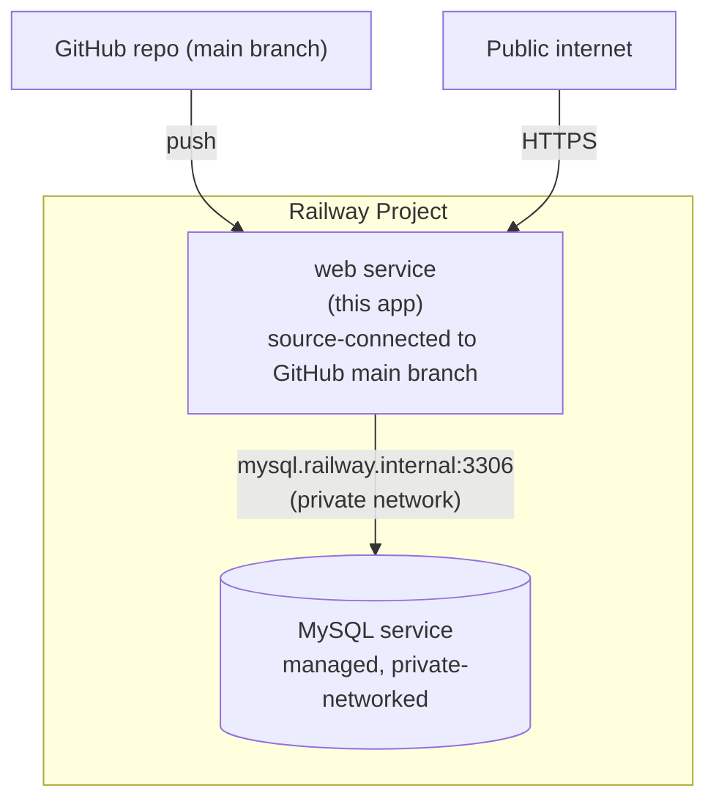

# Deployment (Railway)

**Live instance:** https://web-production-581a.up.railway.app

Deployed as two services inside one Railway project:



`web` and `MySQL` communicate over Railway's **private network** (`mysql.railway.internal`) — database traffic never leaves Railway's internal infrastructure, and the app's public domain only exposes the HTTP surface, not the database.

## Reproducing this deployment

Prerequisites: a [Railway](https://railway.app) account, the [Railway CLI](https://docs.railway.app/guides/cli) (`brew install railway`), and this repo pushed to your own GitHub.

```bash
railway login

# 1. Create the project
railway init --name your-project-name

# 2. Provision MySQL
railway add --database mysql

# 3. Create the app service and connect it to your GitHub repo
railway add --service web
railway service source connect --repo <you>/<your-repo> --branch main --service web

# 4. Generate a public domain
railway domain --service web --port 3000

# 5. Wire the app to the database using Railway's cross-service variable
#    references — these auto-update if the DB's credentials ever rotate:
railway variable set 'DB_HOST=${{MySQL.MYSQLHOST}}' --service web
railway variable set 'DB_PORT=${{MySQL.MYSQLPORT}}' --service web
railway variable set 'DB_USER=${{MySQL.MYSQLUSER}}' --service web
railway variable set 'DB_PASSWORD=${{MySQL.MYSQLPASSWORD}}' --service web
railway variable set 'DB_NAME=${{MySQL.MYSQLDATABASE}}' --service web

# 6. Set the remaining variables — see .env.example for the full list
railway variable set "NODE_ENV=production" --service web
railway variable set "BASE_URL=https://<your-generated-domain>" --service web
railway variable set "CORS_ORIGIN=https://<your-generated-domain>" --service web
railway variable set "JWT_SECRET=$(node -e "console.log(require('crypto').randomBytes(48).toString('hex'))")" --service web
# ... JWT_EXPIRES_IN, COOKIE_NAME, MAX_LOGIN_ATTEMPTS, LOCK_DURATION_MINUTES,
#     ADMIN_USERNAME, ADMIN_EMAIL, ADMIN_PASSWORD, OTP_EXPIRY_MINUTES
```

## One-time schema + admin setup

The app doesn't run migrations on boot — schema setup and admin seeding are one-time scripts, run locally against the database's **public** proxy (find the host/port with `railway variable list --service MySQL --kv`, under `MYSQL_PUBLIC_URL`):

```bash
DB_HOST=<proxy-host> DB_PORT=<proxy-port> DB_USER=root DB_PASSWORD=<...> DB_NAME=railway \
  node src/scripts/initDb.js

DB_HOST=<proxy-host> DB_PORT=<proxy-port> DB_USER=root DB_PASSWORD=<...> DB_NAME=railway \
  node src/scripts/seedAdmin.js
```

Both scripts are idempotent — safe to re-run.

## Continuous deployment

Because `web` is source-connected to `main`, every `git push` to `main` triggers an automatic rebuild and redeploy. There is no separate CI-triggers-CD step — Railway's own build pipeline (Nixpacks, auto-detecting this as a Node app via `package.json`) handles it.

## Health checks

`GET /health` sits behind admin authentication (see [SECURITY.md](SECURITY.md)), so it isn't usable as a public infrastructure health check as-is — Railway currently just verifies the process is listening on its port. To restore a real HTTP health check without exposing the authenticated diagnostics endpoint, add a small public `GET /healthz` liveness route (returns `200 OK` with no DB query) and point Railway's health check at that instead — tracked in the README's Future Enhancements.

## Rollback

Railway keeps deployment history per service — `railway service status --service web` and the Railway dashboard's "Deployments" tab both let you redeploy a previous build without needing a new git commit.
