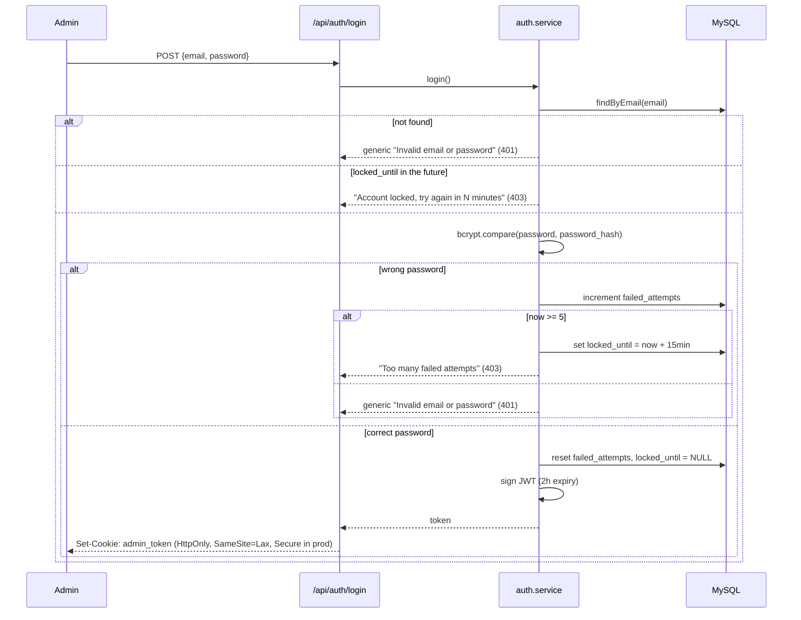
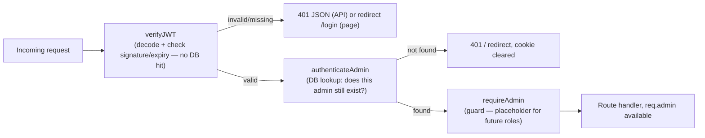

# Security

Technical deep-dive into this project's security design. For how to *report* a vulnerability, see the top-level [SECURITY.md](../SECURITY.md).

## Threat-model summary

Single-role admin system, no public user accounts. The attack surface that matters most: (1) the public shorten/redirect endpoints being abused, (2) the admin login being brute-forced, (3) a stolen session token, (4) injection (SQL/XSS/HPP) against public input fields.

## Authentication

**Why bcrypt, not SHA-256 or plaintext:** plaintext leaks directly on any DB breach. General-purpose fast hashes (SHA-256) are *designed* to be fast — exactly wrong for passwords, since it makes brute-forcing billions of guesses/sec on cheap GPU hardware trivial. bcrypt is deliberately slow with a tunable cost factor (12 rounds here) and salts automatically, defeating both brute-force and rainbow-table attacks.

**Why generic error messages:** "Invalid email or password" never reveals *which* field was wrong — a message like "no account with that email" would let an attacker enumerate valid admin emails.

## Authorization: the three-middleware chain

Three separate middlewares instead of one combined check:
- `verifyJWT` is cheap (no DB) and runs on every protected request without adding database load just to check a signature.
- `authenticateAdmin` catches the case where an admin account was deleted *after* a still-unexpired token was issued.
- `requireAdmin` is currently a thin guard (single-role system), kept separate so a future multi-role system (`requireAdmin(['superadmin'])`) has a natural place to grow into without re-plumbing every route.

## Session / cookie security

| Flag | Effect |
|---|---|
| `httpOnly: true` | Client-side JavaScript cannot read the cookie at all — the primary defense against token theft via XSS. |
| `secure: true` (production) | Cookie is only ever transmitted over HTTPS. |
| `sameSite: 'lax'` | Cookie isn't attached to most cross-site requests — mitigates CSRF. |
| 2-hour JWT expiry | Bounds the damage window of a compromised token; no server-side revocation exists, so short expiry is the primary mitigation (see [README's Interview Prep](../README.md#interview-prep) for the full trade-off discussion). |

**Why not `localStorage`:** fully readable by any JavaScript on the page — your own code, a compromised third-party script, or an injected XSS payload. A single XSS bug anywhere means full token exfiltration. An `HttpOnly` cookie removes the token from JS's reach entirely, and the browser attaches it automatically (no manual fetch header wiring, no place to forget it).

## Brute-force defense in depth

Two independent mechanisms, deliberately not merged into one:
- **Per-account lockout** (`admins.failed_attempts`/`locked_until`) — stops one account being brute-forced from many IPs (e.g. a botnet).
- **Per-IP rate limiting** (`loginLimiter`, `otpRequestLimiter`, `otpVerifyLimiter` in `src/middleware/rateLimiter.js`) — stops one IP from brute-forcing/spamming many accounts or the OTP endpoints.

A 6-digit OTP has only ~1,000,000 possibilities — without `otpVerifyLimiter` capping verification attempts, it would be brute-forceable well within its 10-minute expiry window.

## Injection defense

- **SQL injection**: every query in `src/models/*.model.js` uses `mysql2`'s named placeholders — user input is never string-concatenated into SQL.
- **XSS**: `src/middleware/security.js` sanitizes `req.body`/`req.query`/`req.params` recursively via the `xss` package before any handler sees them; Helmet also sets a restrictive Content-Security-Policy.
- **HPP (HTTP Parameter Pollution)**: `hpp()` middleware strips duplicate query parameters that could otherwise confuse validation logic.

## Password reset (OTP) — no real email account exposed

The forgot-password flow sends its OTP through **Ethereal**, Nodemailer's own sandboxed test-SMTP service — not a real email provider. This was a deliberate choice: wiring up a real personal or team email account (even via SMTP app password) is a real credential-exposure risk in a public repository, and Ethereal exercises the exact same SMTP send code path a real provider would use, without any real credentials existing anywhere in the codebase or environment. See [CACHE.md](CACHE.md)-style production-swap note: in production, only `src/services/email.service.js`'s transporter needs to change (to Resend/SendGrid/Brevo/etc. via an API-key env var) — nothing else in the auth flow changes.

The OTP itself is SHA-256-hashed at rest (not stored in plaintext), single-use (cleared after a successful reset), and time-boxed to 10 minutes.

## Audit logging

Every security-relevant action is recorded in `admin_logs` with the acting admin (when known), IP, user agent, and timestamp: `login`, `login_failed`, `account_locked`, `login_blocked_locked`, `logout`, `password_change`, `password_reset_requested`, `password_reset`, `delete_url`, `restore_url`.

## Known limitations (stated explicitly, not hidden)

- No JWT revocation mechanism — a stolen token is valid until it naturally expires (2 hours). A production system handling more sensitive data would add a token blocklist or move to short-lived access tokens + refresh tokens.
- Single admin role — no granular permissions yet (see `requireAdmin`'s design note above for the intended extension point).
- `/health` is behind auth, which means it can't currently serve as an automated infrastructure health check without a session (see [DEPLOYMENT.md](DEPLOYMENT.md)).
